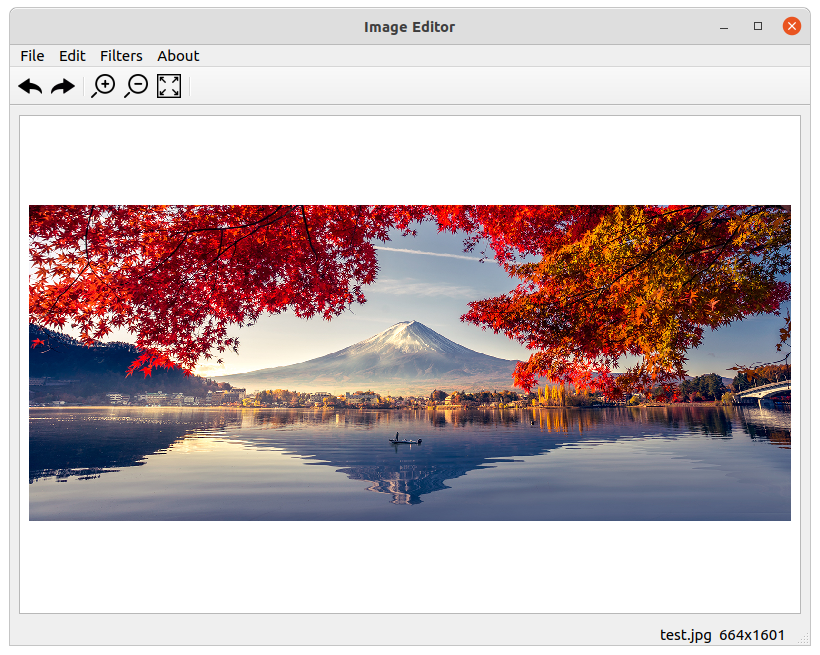

# Image-Editor

Image editor written in C++ and Qt5 for Programmazione class teached by Marco Bertini. It provides basic functionalities to manipulate images:
 * Editing:
     * Rotate clockwise
     * Rotate anticlockwise
     * Flip X
     * Flip Y
     * Grayscale
     * ColorMask
     * Brightness
     * Contrast
     * Scale

  * Filters (convolution):
     * Blur
     * Sharpen
     * Emboss
     * Edge detect

### How to compile ###
GTest lib suite is already included in the project. The only thing to modify to be able to compile the project is the Path to Qt5 library files. Just modify the variable `CMAKE_PREFIX_PATH` (CMakeLists.txt file located in the root folder of the repo) to your actual location of Qt libraries. The compilation process works already in Clion and QtCreator. For other Ides some adjustment may be done.

Note: the C++ compiler version to compile the project should be compatible at least with C++ 11.

### How to run the App ###
An alpha executable for Linux (Ubuntu 18 or newer) and Windows has been released.
